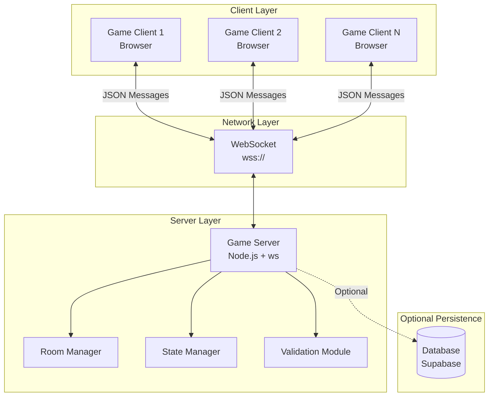

# Design Document: Online Multiplayer

## Overview

This design document specifies the technical architecture for adding real-time online multiplayer functionality to the papmongus game. The system enables remote players to join shared game sessions over the internet using WebSocket connections for bidirectional communication.

### Core Architecture Pattern

The design follows a **client-server authoritative model** where:
- **Game Server** maintains the authoritative game state
- **Game Clients** send input events and receive state updates
- State synchronization happens via WebSocket message broadcasting
- Server validates all gameplay-critical actions (kills, voting, task completion)

### Key Design Goals

1. **Low Latency**: Movement updates at 20Hz with <50ms server broadcast delay
2. **Simplicity**: No authentication required, room-based matchmaking with 6-character codes
3. **Backward Compatibility**: Preserve existing single-player and local co-op modes
4. **Scalability**: Support 50 concurrent connections (5 full 10-player rooms)
5. **Resilience**: Graceful handling of disconnections and reconnections

## Architecture

### High-Level System Diagram



### Component Responsibilities

| Component | Responsibility |
|-----------|---------------|
| **Game Client** | Renders game, captures input, sends events, applies state updates |
| **WebSocket Layer** | Manages persistent bidirectional connections |
| **Game Server** | Routes messages, validates actions, manages rooms |
| **Room Manager** | Creates/destroys rooms, manages room lifecycle |
| **State Manager** | Maintains authoritative game state per room |
| **Validation Module** | Validates gameplay actions (speed, distance, cooldowns) |
| **Database** | Optional persistence for statistics and matchmaking |

### Network Topology

- **Star Topology**: All clients connect to a central Game Server
- **No Peer-to-Peer**: Clients never communicate directly with each other
- **Server Authority**: Server is the single source of truth for game state
- **Broadcast Pattern**: Server broadcasts validated state updates to all room members

### Technology Stack

- **Client**: Vanilla JavaScript (existing codebase)
- **Server**: Node.js 18+ with `ws` library for WebSocket handling
- **Protocol**: WebSocket (wss:// in production, ws:// in development)
- **Message Format**: JSON with typed message envelopes
- **Deployment**: Render (PaaS) or equivalent Node.js hosting
- **Optional Database**: Supabase PostgreSQL for statistics


## Components and Interfaces

### Client-Side Components

#### 1. NetworkManager (New)

**Purpose**: Manages WebSocket connection lifecycle and message routing

**Location**: `src/network.js`

**Key Methods**:
```javascript
class NetworkManager {
  constructor(serverUrl)
  connect()                          // Establish WebSocket connection
  disconnect()                       // Clean disconnect
  send(messageType, payload)         // Send typed message to server
  on(messageType, handler)           // Register message handler
  reconnect()                        // Attempt reconnection with exponential backoff
}
```

**Responsibilities**:
- Establish and maintain WebSocket connection
- Implement reconnection logic (5 attempts, 3-second intervals)
- Serialize/deserialize JSON messages
- Route incoming messages to registered handlers
- Emit connection state events (connected, disconnected, error)

**State**:
- `connectionState`: 'disconnected' | 'connecting' | 'connected' | 'reconnecting'
- `reconnectAttempts`: number (0-5)
- `messageHandlers`: Map<messageType, callback[]>
- `pendingMessages`: queue of messages to send when reconnected


#### 2. MultiplayerGameEngine (Extended)

**Purpose**: Extends GameEngine to handle multiplayer game mode

**Location**: `src/main.js` (extends existing GameEngine class)

**New Properties**:
```javascript
this.isMultiplayer = false           // Flag for multiplayer mode
this.networkManager = null           // NetworkManager instance
this.roomCode = null                 // Current room code
this.isHost = false                  // Whether this client is the host
this.remotePlayers = Map()           // Map<playerId, RemotePlayer>
this.localPlayerId = null            // This client's player ID
this.lastPositionUpdate = 0          // Timestamp for throttling position updates
```

**New Methods**:
```javascript
startMultiplayerMode(mode)           // mode: 'create' | 'join'
createRoom()                         // Request room creation from server
joinRoom(roomCode)                   // Join existing room
sendPositionUpdate()                 // Throttled to 20Hz
sendActionEvent(action)              // Send kill/report/vote/task events
handleRemotePositionUpdate(data)     // Apply position update from server
handleRemoteActionEvent(data)        // Apply remote player action
leaveRoom()                          // Clean disconnect from room
```

**Integration Points**:
- Calls existing `GameEngine.update()` for local game logic
- Intercepts action key presses to send network events
- Renders remote players using existing `drawCrewmate()` function
- Synchronizes game state transitions (LOBBY → PLAYING → MEETING → GAMEOVER)


#### 3. RemotePlayer (New)

**Purpose**: Represents a remote player with interpolation

**Location**: `src/entity.js`

**Class Definition**:
```javascript
class RemotePlayer extends BaseEntity {
  constructor(id, nickname, color)
  updatePosition(x, y, timestamp)    // Set target position with timestamp
  interpolate(deltaTime)             // Smooth movement interpolation
  getDisplayPosition()               // Get interpolated position for rendering
}
```

**Responsibilities**:
- Store server-provided position and state
- Implement linear interpolation between position updates for smooth movement
- Inherit rendering behavior from BaseEntity
- Handle cosmetic synchronization (color, hat)

**Interpolation Strategy**:
- Server sends position updates at 20Hz (every 50ms)
- Client interpolates between last known position and target position
- Extrapolation for up to 100ms if no update received
- Snap to server position if difference exceeds 50 pixels (anti-desync)


#### 4. MultiplayerUI (New)

**Purpose**: UI components for room creation/joining and lobby

**Location**: `src/multiplayer-ui.js`

**Key Elements**:
- Room creation screen with "CREATE ROOM" button
- Room joining screen with 6-character code input
- Lobby screen showing connected players, their colors, and readiness
- Room code display (large, copyable)
- Host controls (start game, kick players, adjust settings)
- Network status indicator (ping, connection quality)

**Methods**:
```javascript
showRoomCreationScreen()
showRoomJoinScreen()
showLobbyScreen(players, isHost)
updatePlayerList(players)
displayRoomCode(code)
showConnectionStatus(status)
showErrorMessage(message)
```


### Server-Side Components

#### 1. GameServer (New)

**Purpose**: WebSocket server and main entry point

**Location**: `server/server.js`

**Key Responsibilities**:
- Initialize WebSocket server on specified port
- Handle new client connections
- Route messages to appropriate handlers
- Implement health check endpoint
- Manage graceful shutdown

**Initialization**:
```javascript
const wss = new WebSocketServer({ port: process.env.PORT || 3000 });

wss.on('connection', (ws, req) => {
  const clientId = generateClientId();
  clients.set(clientId, ws);
  
  ws.on('message', (data) => handleMessage(clientId, data));
  ws.on('close', () => handleDisconnect(clientId));
  ws.on('error', (err) => handleError(clientId, err));
});
```

**Message Routing**:
```javascript
function handleMessage(clientId, data) {
  const message = JSON.parse(data);
  
  switch (message.type) {
    case 'CREATE_ROOM':
      RoomManager.createRoom(clientId, message.payload);
      break;
    case 'JOIN_ROOM':
      RoomManager.joinRoom(clientId, message.payload.roomCode);
      break;
    case 'POSITION_UPDATE':
      StateManager.handlePositionUpdate(clientId, message.payload);
      break;
    // ... other message types
  }
}
```


#### 2. RoomManager (New)

**Purpose**: Manages room lifecycle and player membership

**Location**: `server/roomManager.js`

**Data Structure**:
```javascript
const rooms = new Map(); // roomCode -> Room

class Room {
  constructor(code, hostId) {
    this.code = code;              // 6-char alphanumeric
    this.hostId = hostId;          // Client ID of host
    this.players = new Map();      // clientId -> Player
    this.state = 'WAITING';        // WAITING | PLAYING | MEETING | ENDED
    this.createdAt = Date.now();
    this.gameState = null;         // GameState object when playing
    this.settings = {
      maxPlayers: 10,
      imposторCount: 1,
      killCooldown: 25,
      playerSpeed: 3.5,
      // ... other settings
    };
  }
}
```

**Key Methods**:
```javascript
createRoom(hostId, settings)       // Generate code, create room, return code
joinRoom(clientId, roomCode)       // Add player to room, broadcast join event
leaveRoom(clientId)                // Remove player, handle host migration
getRoomByClient(clientId)          // Find room containing client
getRoomByCode(roomCode)            // Find room by code
startGame(roomCode)                // Transition to PLAYING, initialize game state
endGame(roomCode, result)          // Transition to ENDED, broadcast results
cleanupStaleRooms()                // Remove rooms older than 2 hours
```

**Room Code Generation**:
- 6 characters: uppercase letters (A-Z) and digits (0-9)
- Excludes ambiguous characters: 0/O, 1/I, 5/S
- Collision checking with retry
- Example: `XK7N92`


#### 3. StateManager (New)

**Purpose**: Maintains authoritative game state and broadcasts updates

**Location**: `server/stateManager.js`

**GameState Structure**:
```javascript
class GameState {
  constructor(room) {
    this.roomCode = room.code;
    this.players = new Map();      // playerId -> PlayerState
    this.deadBodies = [];
    this.tasks = [];               // Global task list
    this.completedTasks = 0;
    this.totalTasks = 0;
    this.meetingState = null;      // MeetingState | null
    this.sabotageState = null;     // SabotageState | null
    this.timestamp = Date.now();   // Server time for synchronization
  }
}

class PlayerState {
  constructor(id, nickname, color) {
    this.id = id;
    this.nickname = nickname;
    this.color = color;
    this.x = 0;
    this.y = 0;
    this.isAlive = true;
    this.isImpostor = false;
    this.tasks = [];               // Assigned tasks for this player
    this.killCooldown = 0;
    this.equippedHat = null;
  }
}
```

**Key Methods**:
```javascript
initializeGameState(room)          // Create initial game state, assign roles
updatePlayerPosition(playerId, x, y) // Validate and update position
handleKillAttempt(killerID, victimId) // Validate kill, update state if valid
handleTaskCompletion(playerId, taskId) // Mark task complete, check win condition
handleMeetingTrigger(reporterId, bodyId) // Start meeting state
handleVote(playerId, targetId)     // Record vote during meeting
checkWinConditions()               // Check if game should end
broadcastState(room, message)      // Send state update to all players in room
```


#### 4. ValidationModule (New)

**Purpose**: Server-side validation of gameplay actions to prevent cheating

**Location**: `server/validation.js`

**Validation Rules**:

**Movement Validation**:
```javascript
function validateMovement(prevPos, newPos, deltaTime, maxSpeed) {
  const distance = Math.sqrt((newPos.x - prevPos.x) ** 2 + (newPos.y - prevPos.y) ** 2);
  const maxDistance = maxSpeed * (deltaTime / 1000) * 60; // Convert to pixels
  
  if (distance > maxDistance * 1.2) { // 20% tolerance for lag
    return false; // Speed hack detected
  }
  return true;
}
```

**Kill Validation**:
```javascript
function validateKill(killer, victim, gameState) {
  // Check if killer is impostor
  if (!killer.isImpostor) return { valid: false, reason: 'not_impostor' };
  
  // Check if victim is alive
  if (!victim.isAlive) return { valid: false, reason: 'already_dead' };
  
  // Check distance
  const distance = Math.sqrt((killer.x - victim.x) ** 2 + (killer.y - victim.y) ** 2);
  if (distance > KILL_RANGE) return { valid: false, reason: 'too_far' };
  
  // Check cooldown
  if (killer.killCooldown > 0) return { valid: false, reason: 'on_cooldown' };
  
  return { valid: true };
}
```

**Vote Validation**:
```javascript
function validateVote(playerId, targetId, meetingState) {
  // Check if player already voted
  if (meetingState.votes.has(playerId)) return false;
  
  // Check if target is alive (or skip vote)
  if (targetId !== 'skip' && !gameState.players.get(targetId).isAlive) return false;
  
  return true;
}
```


## Data Models

### Client-Server Message Protocol

All messages follow a typed envelope structure:

```typescript
interface Message {
  type: MessageType;
  payload: any;
  timestamp?: number;  // Server timestamp for synchronization
}

type MessageType = 
  // Connection & Room Management
  | 'CREATE_ROOM'
  | 'ROOM_CREATED'
  | 'JOIN_ROOM'
  | 'ROOM_JOINED'
  | 'LEAVE_ROOM'
  | 'PLAYER_JOINED'
  | 'PLAYER_LEFT'
  | 'START_GAME'
  | 'GAME_STARTED'
  
  // Game State Synchronization
  | 'POSITION_UPDATE'
  | 'STATE_SYNC'
  | 'ACTION_EVENT'
  
  // Gameplay Events
  | 'KILL_ATTEMPT'
  | 'KILL_CONFIRMED'
  | 'TASK_COMPLETED'
  | 'MEETING_TRIGGERED'
  | 'VOTE_CAST'
  | 'VOTING_RESULTS'
  | 'GAME_ENDED'
  
  // Customization
  | 'COLOR_CHANGE'
  | 'COSMETIC_CHANGE'
  
  // Errors & Notifications
  | 'ERROR'
  | 'KICKED'
  | 'DISCONNECTED';
```


### Message Payload Specifications

#### CREATE_ROOM (Client → Server)
```json
{
  "type": "CREATE_ROOM",
  "payload": {
    "playerNickname": "Player1",
    "playerColor": "red",
    "settings": {
      "maxPlayers": 10,
      "impostorCount": 1,
      "killCooldown": 25,
      "playerSpeed": 3.5
    }
  }
}
```

#### ROOM_CREATED (Server → Client)
```json
{
  "type": "ROOM_CREATED",
  "payload": {
    "roomCode": "XK7N92",
    "playerId": "p_abc123",
    "isHost": true
  },
  "timestamp": 1703001234567
}
```

#### JOIN_ROOM (Client → Server)
```json
{
  "type": "JOIN_ROOM",
  "payload": {
    "roomCode": "XK7N92",
    "playerNickname": "Player2",
    "playerColor": "blue"
  }
}
```

#### ROOM_JOINED (Server → Client)
```json
{
  "type": "ROOM_JOINED",
  "payload": {
    "roomCode": "XK7N92",
    "playerId": "p_def456",
    "players": [
      {
        "id": "p_abc123",
        "nickname": "Player1",
        "color": "red",
        "isHost": true,
        "equippedHat": "tophat"
      },
      {
        "id": "p_def456",
        "nickname": "Player2",
        "color": "blue",
        "isHost": false,
        "equippedHat": null
      }
    ],
    "settings": { /* room settings */ }
  },
  "timestamp": 1703001234600
}
```


#### POSITION_UPDATE (Client → Server)
```json
{
  "type": "POSITION_UPDATE",
  "payload": {
    "x": 450.5,
    "y": 320.8,
    "isFacingLeft": true,
    "isMoving": true
  }
}
```

#### STATE_SYNC (Server → All Clients in Room)
```json
{
  "type": "STATE_SYNC",
  "payload": {
    "players": [
      {
        "id": "p_abc123",
        "x": 450.5,
        "y": 320.8,
        "isFacingLeft": true,
        "isMoving": true,
        "isAlive": true
      },
      {
        "id": "p_def456",
        "x": 550.2,
        "y": 400.1,
        "isFacingLeft": false,
        "isMoving": false,
        "isAlive": true
      }
    ],
    "deadBodies": [],
    "taskProgress": 0.35
  },
  "timestamp": 1703001234650
}
```

#### KILL_ATTEMPT (Client → Server)
```json
{
  "type": "KILL_ATTEMPT",
  "payload": {
    "victimId": "p_def456"
  }
}
```

#### KILL_CONFIRMED (Server → All Clients)
```json
{
  "type": "KILL_CONFIRMED",
  "payload": {
    "killerId": "p_abc123",
    "victimId": "p_def456",
    "bodyX": 550.2,
    "bodyY": 400.1
  },
  "timestamp": 1703001234700
}
```

